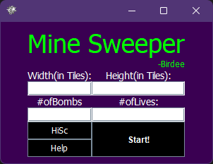
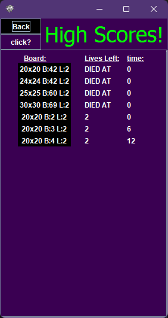
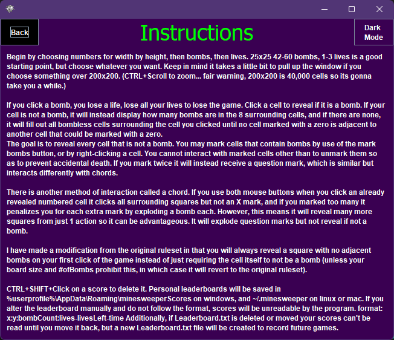
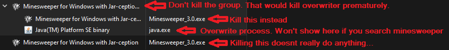

**MINESWEEPER**

I couldn't easily find a minesweeper game on the store that allowed you to actually set the size of the field
or the number of bombs or lives... 

So I made one! 

Mostly I just wanted to learn some Java.

You can learn too! Source code is included with the installer, as well as a compile script, 
which will update your actual installed version of the game that you can run from your start menu.
Go to the install folder of your game, and read the README in app/ or lib/app for more info.

```

If you have come looking for answers from the tutorial experience, theyre in Grid class, in the same spot.

```

If you plan to just play the game from the jar, and have it in a writeable directory, this is probably the best version. 

If you have a java version, the jar is so small that it is textable (140kb if you download the jar that doesnt contain source, package Icon, etc, 235 otherwise), 

and it contains your scores, meaning you can pick back up where you left off without sending the scores file separately.

You can replace the jar in the game files of any of the other installations with this one if you wish, as long as they are in a writeable directory.

**Attention:** This version is kinda dumb. Its also kinda cool. It exists as a proof of concept and because I wanted to try.

Why is it so dumb? It saves its scores to the temp folder, and then overwrites itself on exit with a new jar containing the new scores. 

This means I can't make a linux package because all locations linux could install it to with dpkg are not writeable, 
so linux needs to use the jar and a JDK for this one.

It also means I need a native java executable in the windows package, so the package installer is an extra 10 MB.

It also means that if you put it on a USB, you can play it on any computer and it will always have your scores. Which is kinda cool.

**Attention:** Is it better? No it's worse. 

    - If you open 1 jar many times, there will be no issue (even if it crashes, which it won't. As long as the overwriter program continues running, it will save. Otherwise, open and close game to fix save.)
    - If you open 2 different versions of the jar, 
        - the first jar to be closed will recieve new scores from both files, and the original scores from the first jar that was opened.
        - the second jar to be closed will keep its original scores, but it will not recieve any new scores.
        - If you didnt update the scores file, either by new highscore, or delete, nothing will happen.

But its also significantly cooler in my opinion. Also I used swing so I can't easily use GraalVM to make a true native version so I settled on making it interesting.

|                                                     |                                                     |
|-----------------------------------------------------|-----------------------------------------------------|
|          |       |
|  |      |

|                                                |                                               |                                               |
|------------------------------------------------|-----------------------------------------------|-----------------------------------------------|
|  |  |  |



************************************************************************************

**WINDOWS**

____________________________________________________________________________________

Download the EXE. Launch it. 

This will launch an installer.

game installs to %userprofile%\AppData\Local\Minesweeper (or wherever you tell it to)

scores save to %userprofile%\AppData\Roaming\minesweeperScores

It will have source code and compile scripts inside the game folder after install. 

(Also, it will give you a windows defender warning because I didnt pay for it to be a signed installer.
If that worries you, the source code and scripts used to build it are available right here,
and instructions are below. Or get a jdk and use the jar file.)

**********************************************************************************************************************

**PLATFORM INDEPENDENT:**

____________________________________________________________________________________

Download the .jar file inside app directory.

Install a Java runtime (jdk 17+ preferred), 

https://www.oracle.com/java/technologies/javase/jdk17-archive-downloads.html

use "java -jar <_path_>/<_to_>/minesweeper.jar" to play!

Make sure jdk is added to your path, or run the java binary directly.

Inside the Jar, you will find a replica of the app directory.

If you wish to access these files to edit the program, use:

jar -xvf ./minesweeper.jar && rm -r MySweep/ META-INF/

If you have another version of jdk already, 
but it wont let you run due to incompatible version,
you can probably just recompile. run the appropriate compile script if you have the github repo, or if you only had the package installer,
then the compile script is in \<install_directory\>/minesweeper/lib/app/ and the source is included.

if your computer is unable to install jdk 17 and run programs with it, such as ubuntu 20 or earlier, 
then the .deb installer script may not work on your system, because java requires C libraries that are not present at runtime.
You dont have to install jdk 17, just be capable of installing it.

However, using the jar can work with older versions of jdk back to about 11

***************************************************************************************************************************

**If you cloned the repo rather than following one of the above options:**

____________________________________________________________________________________

*Windows:*

If on windows, run the installer unless you just wanna use the jar and have a java version.

*Linux or Mac:*

use platform independent instructions above.

*************************************************************************************************************************************************

**OTHER INSTRUCTIONS:**

____________________________________________________________________________________________________________________________

Download a Java Development kit for the below instructions (if you have 2.0, you will only need it to create an installer):

https://www.oracle.com/java/technologies/javase/jdk17-archive-downloads.html

______________________________________________________________________________________________________________________

**WINDOWS COMPILE**

____________________________________________________________________________________

to compile to jar on windows, go to ".\app\Compiling" and run wincompile.bat

************************************************************************************

**LINUX COMPILE**

____________________________________________________________________________________

TO COMPILE JAR:

make sure you have a JDK.
cd to app/Compiling and run bashcompile.sh to compile jar.

*************************************************************************************

**MAC**

_____________________________________________________________________________________

I havent had a computer that can make a package installer for Mac. Download a jdk and the .jar file in the app directory.

run with java -jar path/to/minesweeper.jar

Inside the Jar, you will find a replica of the app directory.

If you wish to access these files to edit the program, use:

jar -xvf ./minesweeper.jar && rm -r MySweep/ META-INF/

To recompile, use the script ./Compiling/bashcompile.sh just like for linux.

If you can get the package script working on mac let me know and send the script so I can package it on a friend's mac when I have the time! 

I dont have a mac that can install a new enough version of xcode to meet the dependency requirements for jpackage so I can't do it myself right now.

_____________________________________________________________________________________

**for further instructions on compiling and creating installers**

go to README.md inside app folder.

____________________________________________________________________________________
***Have fun!!!!!!!!!!***
************************************************************************************

(also you can 1.5 click without waiting for mouse release, and always hit a 0 first click and you can turn off the question marks)
