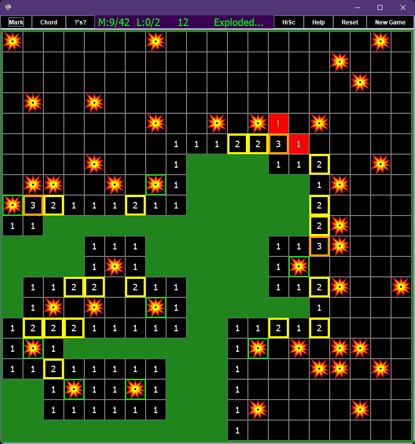

**MINESWEEPER**

I couldn't easily find a minesweeper game on the store that allowed you to actually set the size of the field
or the number of bombs or lives... 

So I made one! 

Mostly I just wanted to learn some Java.

----------------------------------------------------------------------------------------------------------------------------------------------------

You can learn too! Source code is included with the installer, as well as a compile script, 
which will update your actual installed version of the game that you can run from your start menu.

It has a lot more than that actually. It has a full learn to code java guide inside the source code.

Yes. Inside the source code. This entire game is a learn to code guide.

It begins with HowToCodeJava.txt, and then you walk along the program in a particular (but not too convoluted) order.

It has comments along the way and introduces concepts in a gradually increasing order of difficulty. (or, as close to that as possible while still being a game!!)

And it ends with a coding excercise that should hopefully be within grasp once you make it to the end, where you fix a slight bug. (with hints!) 

(Bug does not affect gameplay. But it was a real bug. I made it. On accident. Yes there is a link to solutions... try not to use it.)

It should be challenging, but definitely not impossible, even if you have no previous knowledge of coding. You will need to pay close attention.

(Dont forget to reference back to the opening text file where I explain what you dont understand as it gets reintroduced when necessary!)

Of course, at a certain point you have to DO, rather than read. But this will get you to that point.

Go to the install folder of your game, and read the README in app/ or lib/app for more info.

Don't clone the repo it just has extra stuff. Download an installer, (or just the .jar file in app folder and extract it. Instructions below.)

Inside is an entire copy of the app folder of this repo.

---------------------------------------------------------------------------------------------------------------------------------------------------

**version 1.0** is the normal version for those who just want a good minesweeper game.

**version 2.0** contains a compiler you can use, but is an extra 10MB. Recommended for learners, because you can jump in with no extra steps!

if you have 1.0 you will need a version of Java Development Kit to recompile if you wish to edit.

including the compiler on linux made it over 100MB for some reason so I couldnt add an installer with an included compiler.

regardless of version, you will need a JDK to make your own installer.

|                                                     |                                                     |
|-----------------------------------------------------|-----------------------------------------------------|
|          |       |
|  |      |

************************************************************************************

**WINDOWS**

____________________________________________________________________________________

Download the EXE. Launch it. 

This will launch an installer.

game installs to %userprofile%\AppData\Local\Minesweeper (or wherever you tell it to)

scores save to %userprofile%\AppData\Roaming\minesweeperScores

It will have source code and compile scripts inside the game folder after install. 

(Also, it will give you a windows defender warning because I didnt pay for it to be a signed installer.
If that worries you, the source code and scripts used to build it are available right here,
and instructions are below. Or get a jdk and use the jar file.)

---------------------------------------------------------------------------------------------

**MAC**

I was unfortunately unable to make a mac .pkg file with the system i had access to.
If you want to run it on mac, use the .jar file. You will need to download a JDK for Mac.

************************************************************************************

**LINUX USERS:**

____________________________________________________________________________________

Also contains the source code and compile and package scripts with the package.

Use the script and not the .deb file to install to add to path and make it background itself when run from terminal,
otherwise some package launchers like dmenu (the default on i3) cant find it.

It would work fine though if you used the .deb other than being less convenient to use it from the command line

If you are planning to learn Java rather than just play, you will unfortunately have to copy your game from its install folder to a directory that doesnt require sudo.

So in that case, use the .deb file. It wont get added to your path, but you will also be able to see error messages because it wont be running from a script that hides those.

dpkg has certain install locations it allows....

**If you are learning java, download the .deb file (or the .jar) for the reasons stated above.** 
```bash
wget -O minesweeper_1.0-1_amd64.deb https://github.com/BirdeeHub/minesweeper/raw/main/minesweeper_1.0-1_amd64.deb && \
sudo dpkg -i ./minesweeper_1.0-1_amd64.deb
```

**Otherwise, better playing experience from command line launch:**

move to a writeable directory and run the following command (requires wget):
```bash
wget -O minesweeper_linux_dist.zip https://github.com/BirdeeHub/minesweeper/raw/main/minesweeper_linux_dist.zip && \
unzip minesweeper_linux_dist.zip -d minesweeper_linux_dist && \
sudo ./minesweeper_linux_dist/installLinuxMinesweeper.sh
```

```bash
##and, optionally, you can run these to move the install scripts to the folder scores save in after the install
[ ! -d ~/.minesweeper/ ] && mkdir ~/.minesweeper; \
mv ./minesweeper_linux_dist/installLinuxMinesweeper.sh ~/.minesweeper/ && \
mv ./minesweeper_linux_dist/uninstallLinuxMinesweeper.sh ~/.minesweeper/ && \
rm -r ./minesweeper_linux_dist/ ./minesweeper_linux_dist.zip
```

and then to uninstall if installed this way (assuming you ran the optional commands):
```bash
sudo ~/.minesweeper/uninstallLinuxMinesweeper.sh
```

the uninstall script will cleanup the script from /usr/local/bin, but will not delete ~/.minesweeper/ or its contents

The .deb installer script may not work if your system is unable to install jdk 17 and run programs with it, 
because Java requires C libraries that are not present at runtime.
You dont have to install jdk 17 to run it, just be capable of installing it.

**********************************************************************************************************************

**PLATFORM INDEPENDENT:(and should work with older versions)**

**(the .jar file)**

____________________________________________________________________________________

Download the .jar file inside app directory.

Install a Java runtime (jdk 17+ preferred), 

https://www.oracle.com/java/technologies/javase/jdk17-archive-downloads.html

use "java -jar <_path_>/<_to_>/minesweeper.jar" to play!

Make sure jdk is added to your path, or run it with the path to the java binary directly.

Inside the Jar, there is a replica of the app directory. (yes, in a 1/5th of a MB file, that is also a game.)

If you wish to access these files to edit the program, use:

jar -xvf ./minesweeper.jar && rm -r MySweep/ META-INF/

the rm -r command is optional, but those things arent needed to compile. They ARE what was compiled. Or, well, copies of the ones in the jar.

If you have another version of jdk already, 
but it wont let you run due to incompatible version,
you can probably just recompile. run the appropriate compile script. It will require the file structure of the app folder to remain the same.

***************************************************************************************************************************

**If you cloned the repo rather than following one of the above options:**

____________________________________________________________________________________

Cool! All you did was download extra stuff and cheat yourself out of running it from the start menu. 

You can run it from the jar, or just run the installer. Or, look through the code, recompile, repackage, and then run the installer idk.

------------------------------------------------------------------------------------------------------------------------------------------------

**Extra info for linux users:**

Install directory is /usr/local/games, scores save in ~/.minesweeper/

It will create short script called minesweeper in /usr/local/bin so that you can run the game from terminal without it hogging your terminal.

Running via this script will also hide any errors you make, but you dont have to run it via the script. You could go to the actual folder.

To run, use command "minesweeper" or find it in your start menu equivalent.

the script in your /usr/local/bin directory runs 
```bash
$install_directory/minesweeper/bin/Minesweeper $@ >/dev/null 2>&1 < /dev/null &
```
in this case, install_directory is /usr/local/games. Its hard coded in the script, so if you move it, you will have to change that.

*************************************************************************************************************************************************

**OTHER INSTRUCTIONS:**

____________________________________________________________________________________________________________________________

Download a Java Development kit for the below instructions (if you have 2.0, you will only need it to create an installer):

https://www.oracle.com/java/technologies/javase/jdk17-archive-downloads.html

______________________________________________________________________________________________________________________

**WINDOWS COMPILE**

____________________________________________________________________________________

to compile to jar on windows, go to ".\app\Compiling" and run wincompile.bat

************************************************************************************

**LINUX COMPILE**

____________________________________________________________________________________

TO COMPILE JAR:

make sure you have a JDK.
cd to app/Compiling and run bashcompile.sh to compile jar.

*************************************************************************************

**MAC**

_____________________________________________________________________________________

I havent had a computer that can make a package installer for Mac. Download a jdk and the .jar file in the app directory.

run with java -jar path/to/minesweeper.jar

Inside the Jar, you will find a replica of the app directory.

If you wish to access these files to edit the program, use:

jar -xvf ./minesweeper.jar && rm -r MySweep/ META-INF/

To recompile, use the script ./Compiling/bashcompile.sh just like for linux.

If you can get the package script working on mac let me know and send the script so I can package it on a friend's mac when I have the time! 

I dont have a mac that can install a new enough version of xcode to meet the dependency requirements for jpackage so I can't do it myself right now.

_____________________________________________________________________________________

**for further instructions on compiling and creating installers**

go to README.md inside app folder.

____________________________________________________________________________________
***Have fun!!!!!!!!!!***
************************************************************************************

(also you can 1.5 click without waiting for mouse release, and always hit a 0 first click and you can turn off the question marks)
