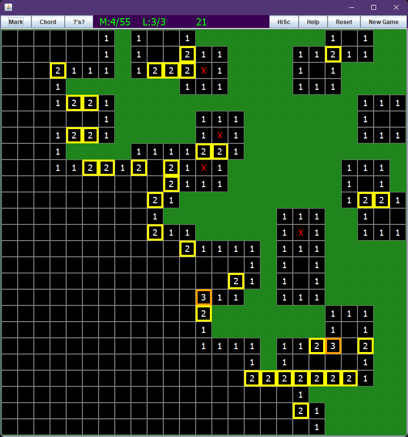

***MINESWEEPER***

Author: Robin DeBoer

There was no minesweeper game on the store that allowed you to actually set the size of the field
or the number of bombs or lives. 
So I made one! 

Mostly I just wanted to learn Java.



You can learn too! Source code is included with the installer, as well as a compile script, 
which will update your actual installed version of the game that you can run from your start menu.
Go to the install folder of your game, and read the README in src for more info.

You will need a version of Java Development Kit to recompile if you wish to edit.

**HOW TO PLAY: (windows)**

************************************************************************************

go to WindowsInstaller directory, and click the exe in that folder.

This will launch an installer.

game installs to %userprofile%\AppData\Local\Minesweeper (or wherever you tell it to)

scores save to %userprofile%\AppData\Roaming\minesweeperScores

(Also, it will give you a windows defender warning because I didnt pay for it to be a signed installer.
If that worries you, the source code and scripts used to build it are available right here,
and instructions are below. Or get a jdk and use the jar file.)

**OR:** use the launch4j exe. make sure exe, and jre folder are in the same folder,
(they are currently at .\minesweeperl4j\minesweeper.exe) and then run the exe!
This exe is made with launch4j and cannot be zipped (its technically a self-extracting archive and that messes with it.)

**MAC AND LINUX USERS:**

************************************************************************************

**If you didnt clone the repo and are on debian linux:**

move to a writeable directory and run the following command (requires wget):
```bash
wget -O minesweeper_linux_dist.zip https://github.com/BirdeeHub/minesweeper/raw/main/linux_or_mac_pkg/linux_dist.zip && \
unzip minesweeper_linux_dist.zip -d minesweeper_linux_dist && \
sudo ./minesweeper_linux_dist/installdebianpackage.sh && \
[ ! -d ~/.minesweeper/ ] && mkdir ~/.minesweeper; \
mv ./minesweeper_linux_dist/uninstalldebianpackage.sh ~/.minesweeper/minesweeper_uninstall.sh && \
rm -r ./minesweeper_linux_dist/ ./minesweeper_linux_dist.zip
##the last 3 of these lines are optional though
```

and then to uninstall if installed this way:
```bash
sudo ~/.minesweeper/minesweeper_uninstall.sh && rm ~/.minesweeper/minesweeper_uninstall.sh
```

**If you cloned the repo:**

Run the appropriate install script for your os in linux_or_mac_pkg USING SUDO

use the script and not the .deb or .pkg file to install to add to path,
otherwise some package launchers like dmenu (the default on i3) cant find it.
It would work fine though it just wouldnt be in your path 
and wouldnt background itself in the teminal unless you told it to if you launched it from there

Install directory is /usr/local/games, scores save in ~/.minesweeper/
It will create short script called minesweeper in /usr/local/bin so that you can run the game from terminal without it freezing your terminal
To run, use command "minesweeper" or find it in your start menu equivalent.
(the script in your /usr/local/bin directory runs <install directory>/minesweeper/bin/Minesweeper >/dev/null 2>&1 < /dev/null &)

**ATTENTION:** I was unfortunately unable to make a mac .pkg file using the script in linux_or_mac_pkg.
Until I can spend an extended time on a mac or get around to trying a mac vm, 
there will be no further mac support than what is here already.
If you still want to run it on mac, use the second option below.

**OR:** Install a Java runtime (jdk 17+ preferred), use "java -jar <_path_>/<_to_>/minesweeper.jar" to play! This will run it from the jar.

Make sure jdk is added to your path, or run the java binary directly.

If you have another version of jdk already, 
but it wont let you run due to incompatible version,
you can probably just recompile. run Compile.sh if you have the github repo, or if you only had the package installer,
then the source code is installdir/minesweeper/lib/src/

Compile.sh runs the following command. You could run it from the lib directory.

```bash
javac ./src/*.java -d minesweeper_classes && jar --create -v --file=jar/minesweeper.jar --main-class=MineSweeper -C minesweeper_classes .
```

You can then run with java -jar ./jar/minesweeper.jar

if your computer is unable to install jdk 17 and run programs with it, such as ubuntu 20 or earlier, 
then the .deb installer script may not work on your system, because java requires c libraries that are not present at runtime.
You dont have to install jdk 17, just be capable of installing it.
However, ./minesweeper.sh can work with older versions of jdk back to about 11

**OTHER INSTRUCTIONS:**

************************************************************************************

***ZIPPING***

for windows, just make an installer... instructions below.

The linux dist zips fine, and for windows you can just send the installer if you wish to share it.

**WINDOWS COMPILE FROM SOURCE TO JAR AND EXE**

************************************************************************************

to only compile to jar on windows, run compile.bat

You will need to download JDK and make sure it is added to your path. 
You can also run the jar without compiling to exe with Minesweeper.bat

**Two choices for exe:**

*better:*

*Make EXE INSTALLER:*

run MakeInstallerExe.bat to make installer using jpackage

jpackage requires Wix toolkit. If you run it without having it,
it will give you a download link.
This will make the installer exe in the WindowsInstaller directory.

*worse:*

*Make Launch4j EXE:*

download launch4j

run MakeBundledJRE.bat if you wish to bundle your own JRE

run CompileJarAndMakeBundledExe.bat

this will compile jar, and then use launch4j to make it into an exe with bundled jre. 
(it will ask for administrator permissions to run launch4j. 
it needs admin privileges to bundle and idk why)
This will make an exe in minesweeperl4j directory.
You may need to make sure the path to launch4jc.exe at the end of 
CompileJarAndMakeBundledExe.bat actually points to your 
Launch4j installation folder if you downloaded it to a different location.
Keep the exe in the same folder as the jre folder.

CompileAllWindows.bat just does both of these and also packages your own jdk. Make sure you have a jdk.

**MAC AND LINUX COMPILE FROM SOURCE TO JAR AND INSTALLER**

************************************************************************************

TO COMPILE JAR

make sure you have a JDK.
run Compile.sh to compile jar.

To make Package Installer:

jpackage may require a dependency. Install it. For mac it is Xcode, and for debian it is dpkg

run ~/minesweeper/linux_or_mac_pkg/createpackage<linux or mac>.sh

this will also recompile from source.
non debian distributions may have to change the type in the command for jpackage.
It doesnt work for mac right now. only jar for mac.
____________________________________________________________________________________
Have fun!!!!!!!!!!
************************************************************************************