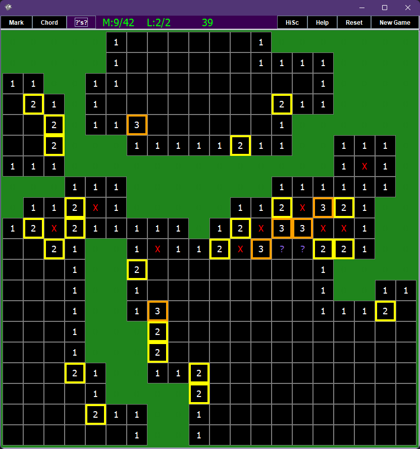
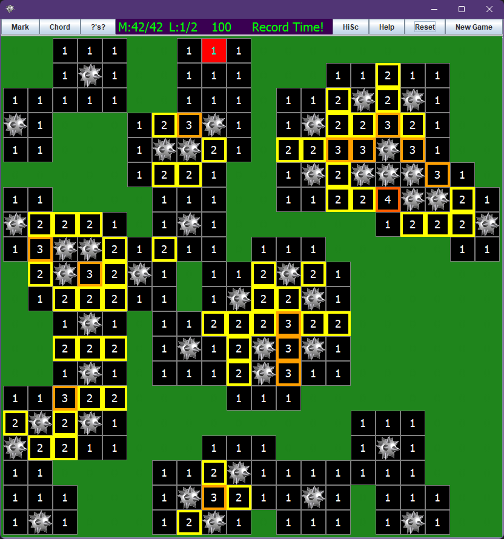

**MINESWEEPER**

I couldn't easily find a minesweeper game on the store that allowed you to actually set the size of the field
or the number of bombs or lives... 

So I made one! 

Mostly I just wanted to learn some Java.

You can learn too! Source code is included with the installer, as well as a compile script, 
which will update your actual installed version of the game that you can run from your start menu.
It has a lot more than that actually. It is an attempt at a full learn to code java guide.
Go to the install folder of your game, and read the README in app/ or lib/app for more info.

**version 1.0** is the normal version

**version 2.0** contains a compiler you can use, but is an extra 10MB.

if you have 1.0 you will need a version of Java Development Kit to recompile if you wish to edit.

including the compiler on linux made it over 100MB for some reason so I couldnt add an installer with an included compiler.

regardless of version, you will need a JDK to make your own installer.

|                                                     |                                                     |
|-----------------------------------------------------|-----------------------------------------------------|
|          |       |
|  |      |

************************************************************************************

**WINDOWS**

____________________________________________________________________________________

Download the EXE. Launch it. 

This will launch an installer.

game installs to %userprofile%\AppData\Local\Minesweeper (or wherever you tell it to)

scores save to %userprofile%\AppData\Roaming\minesweeperScores

It will have source code and compile scripts inside the game folder after install. 

(Also, it will give you a windows defender warning because I didnt pay for it to be a signed installer.
If that worries you, the source code and scripts used to build it are available right here,
and instructions are below. Or get a jdk and use the jar file.)

************************************************************************************

**LINUX USERS:**

____________________________________________________________________________________

Also contains the source code and compile and package scripts with the package.

Use the script and not the .deb file to install to add to path and make it background itself when run from terminal,
otherwise some package launchers like dmenu (the default on i3) cant find it.

It would work fine though if you used the .deb other than being less convenient to use it from the command line

move to a writeable directory and run the following command (requires wget):
```bash
wget -O minesweeper_linux_dist.zip https://github.com/BirdeeHub/minesweeper/raw/main/minesweeper_linux_dist.zip && \
unzip minesweeper_linux_dist.zip -d minesweeper_linux_dist && \
sudo ./minesweeper_linux_dist/installLinuxMinesweeper.sh
```

```bash
##and, optionally, you can run these to move the install scripts to the folder scores save in after the install
[ ! -d ~/.minesweeper/ ] && mkdir ~/.minesweeper; \
mv ./minesweeper_linux_dist/installLinuxMinesweeper.sh ~/.minesweeper/ && \
mv ./minesweeper_linux_dist/uninstallLinuxMinesweeper.sh ~/.minesweeper/ && \
rm -r ./minesweeper_linux_dist/ ./minesweeper_linux_dist.zip
```

and then to uninstall if installed this way (assuming you ran the optional commands):
```bash
sudo ~/.minesweeper/uninstallLinuxMinesweeper.sh
```

the uninstall script will cleanup the script from /usr/local/bin, but will not delete ~/.minesweeper/ or its contents

**********************************************************************************************************************

**PLATFORM INDEPENDENT:**

____________________________________________________________________________________

Download the .jar file inside app directory.

Install a Java runtime (jdk 17+ preferred), 

https://www.oracle.com/java/technologies/javase/jdk17-archive-downloads.html

use "java -jar <_path_>/<_to_>/minesweeper.jar" to play!

Make sure jdk is added to your path, or run the java binary directly.

Inside the Jar, you will find a replica of the app directory.

If you wish to access these files to edit the program, use:

jar -xvf ./minesweeper.jar && rm -r MySweep/ META-INF/

If you have another version of jdk already, 
but it wont let you run due to incompatible version,
you can probably just recompile. run the appropriate compile script if you have the github repo, or if you only had the package installer,
then the compile script is in \<install_directory\>/minesweeper/lib/app/ and the source is included.

if your computer is unable to install jdk 17 and run programs with it, such as ubuntu 20 or earlier, 
then the .deb installer script may not work on your system, because java requires C libraries that are not present at runtime.
You dont have to install jdk 17, just be capable of installing it.

However, using the jar can work with older versions of jdk back to about 11

***************************************************************************************************************************

**If you cloned the repo rather than following one of the above options:**

____________________________________________________________________________________

*Windows:*

If on windows, just run the installer unless you just wanna use the jar.

*Linux:*

either unzip the zip folder, *OR* copy the installLinuxMinesweeper.sh file in Packaging/LinuxInstall into the same directory as the .deb file.

(its designed to get zipped with the .deb and installed that way so it would be in the same folder. 
In the repo, it is not in the right folder. but the zip folder is right there for you.)

Run the install script in LinuxInstall USING SUDO (needs permission to run dpkg and to copy launcher script to /usr/local/bin)

Install directory is /usr/local/games, scores save in ~/.minesweeper/

It will create short script called minesweeper in /usr/local/bin so that you can run the game from terminal without it freezing your terminal.

To run, use command "minesweeper" or find it in your start menu equivalent.

(the script in your /usr/local/bin directory runs \<install_directory\>/minesweeper/bin/Minesweeper $@ >/dev/null 2>&1 < /dev/null &)

**ATTENTION:** I was unfortunately unable to make a mac .pkg file with the system i had access to.
Until I can spend an extended time on a mac or get around to trying a mac vm, 
there will be no further mac support than what is here already.
If you want to run it on mac, use the .jar file. You will need to download a JDK for Mac.

*************************************************************************************************************************************************

**OTHER INSTRUCTIONS:**

____________________________________________________________________________________________________________________________

Download a Java Development kit for the below instructions (if you have 2.0, you will only need it to create an installer):

https://www.oracle.com/java/technologies/javase/jdk17-archive-downloads.html

______________________________________________________________________________________________________________________

**WINDOWS COMPILE**

____________________________________________________________________________________

to compile to jar on windows, go to ".\app\Compiling" and run wincompile.bat

************************************************************************************

**LINUX COMPILE**

____________________________________________________________________________________

TO COMPILE JAR:

make sure you have a JDK.
cd to app/Compiling and run bashcompile.sh to compile jar.

*************************************************************************************

**MAC**

_____________________________________________________________________________________

I havent had a computer that can make a package installer for Mac. Download a jdk and the .jar file in the app directory.

run with java -jar path/to/minesweeper.jar

Inside the Jar, you will find a replica of the app directory.

If you wish to access these files to edit the program, use:

jar -xvf ./minesweeper.jar && rm -r MySweep/ META-INF/

To recompile, use the script ./Compiling/bashcompile.sh just like for linux.

If you can get the package script working on mac let me know and send the script so I can package it on a friend's mac when I have the time! 

I dont have a mac that can install a new enough version of xcode to meet the dependency requirements for jpackage so I can't do it myself right now.

_____________________________________________________________________________________

**for further instructions on compiling and creating installers**

go to README.md inside app folder.

____________________________________________________________________________________
***Have fun!!!!!!!!!!***
************************************************************************************

(also you can 1.5 click without waiting for mouse release, and always hit a 0 first click and you can turn off the question marks)
